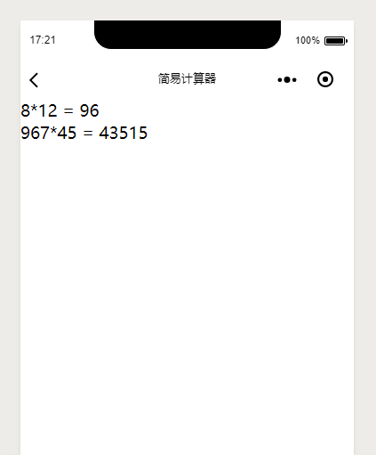

#### 介绍  
记录自己在学习过程中做的小案例
[简易计算器1](https://github.com/liuhualiuhua/FullStack/tree/master/cal) (计算皮相)，案例来源《小程序从0到1 微信全栈工程师一本通》

#### 截图  
  
  

#### 代码讲解  

首页布局 index.wsml

首页计算实现 index.js

历史页面布局：

历史实现：

