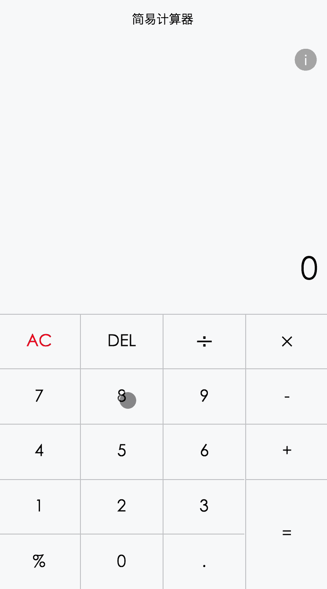

一个微信小程序--简易计算器
============================

这是一个简单的仿小米计算器的微信小程序, 目前比较简单, 仅供参考, 欢迎star。

计算器的逻辑是基于一个简单的状态机实现的, 下面给出了状态机图, 仅供参考。

效果图:
--------
    

* init: 初始状态
* first_undot: 第一个操作数录入中, 无小数点
* first_dot: 第一个操作数录入中, 有小数点
* second_undot: 第二个操作数录入中, 无小数点
* second_dot: 第二个操作数录入中, 有小数点
* result: 结果状态

## 主要特性

* 支持简单的加减乘除和取余数
* 支持连续操作, 比如做了加法以后, 结果会直接作为第一个操作数进入下一轮操作
* 支持删除单个数字和一次性全部清空